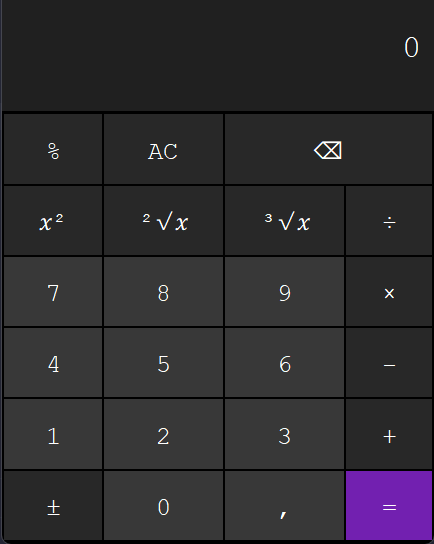

# Calculadora

Calculadora simples criada utilizando Java.

#### Paradigmas:

* Orientação a Objetos
* Funcional

#### Design Patterns:

* Observer
* Singleton
* Strategy

### Funcionalidades:

- **Operações Matemáticas**
    - Soma
    - Subtração
    - Multiplicação
    - Divisão
    - Raiz quadrada
    - Raiz cúbica
    - Número elevado ao quadrado
    - Módulo

### Como executar a calculadora:

- Baixe o java no seu sistema operacional [aqui](https://www.java.com/pt-BR/download/manual.jsp).
- Baixe a calculadora **.jar** em [Releases](https://github.com/julioreigen/calculadora/releases) e abra o arquivo.
- Se deseja somar 10 + 10, clique no número 1 e 0, clique em "+" e clique em 1 e 0 novamente.
- O resultado da operação só aparecerá ao clicar no botão de igual (=).
- Se preferir realizar uma operação com apenas um número, clique no botão da operação desejada (raiz quadrada, módulo, etc.) e clique em igual (=).

    

### Como alterar o código:

1. **Instale o Java Development Kit (JDK) 17 [aqui](https://www.oracle.com/br/java/technologies/downloads/#java17).**
2. **Clone o repositório (ex: `git clone https://github.com/julioreigen/calculadora.git`**
3. **Abra o projeto em uma IDE, a classe principal é a `Calculadora` em `src/host/julio/calc/view/`**

    - **Configuração da IDE Intellij**:
        - Abra o Intellij.
        - Selecione "Open" (Abrir) na tela inicial e selecione a pasta em que o projeto foi clonado.
